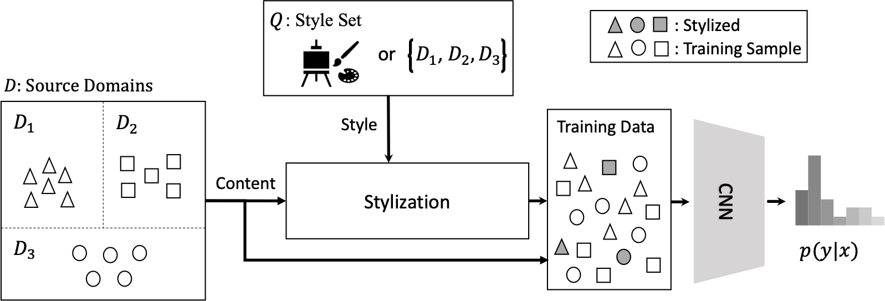

## Frustratingly Simple Domain Generalization via Image Stylization
 

This is the PyTorch implementation of our paper:

**Frustratingly Simple Domain Generalization via Image Stylization** 
[__***Nathan Somavarapu***__](), [Chih-Yao Ma](https://chihyaoma.github.io/), [Zsolt Kira](https://www.cc.gatech.edu/~zk15/) 

[[arXiv(Coming Soon)]()] [[GitHub](https://github.com/GT-RIPL/DomainGeneralization-Stylization)]

Code Coming Soon

## Acknowledgments

This work was funded by DARPA's Learning with Less Labels (LwLL) program under agreement HR0011-18-S-0044.